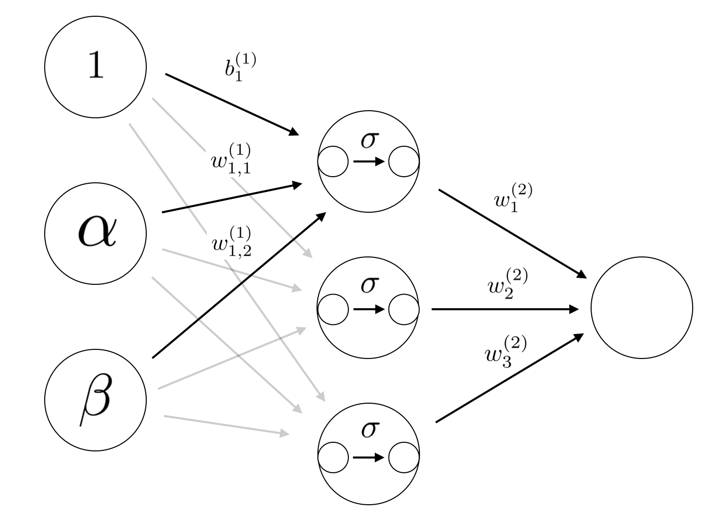

最近シグモイド関数の万能近似能力(Universal Approximation)について勉強したので、お話しします。

###ニューラルネットワーク

ニューラルネットワークの目的は「得られたデータから求める解を与える真の関数(或いは真の分布)をある関数で近似する事」と言えると思います。

真の関数 $f^{\circ}$ がある程度きれいな関数(連続関数や連続関数で近似できる関数)であるとして、どのようにそれを近似すれば良いのでしょうか。

まず以下の構成の2層シグモイドニューラルネットワーク(活性化関数にシグモイド関数を用いたニューラルネットワーク)を考えてみます。

ここで$\sigma$はシグモイド関数を表しています。

入力$\alpha$, $\beta$に対してニューラルネットワークの出力は次のように書けます。

$$
\Sigma_{i=1}^{3} \ ( w^{(2)}_{i}\sigma(w^{(1)}_{i,1}\alpha+w^{(1)}_{i,2}\beta+b^{(1)}_{i}))
$$

つまり真の関数がシグモイド関数の三つの線形結合で近似できる関数であれば(データが十分あれば)上記のニューラルネットワークを用いて近似できるという事になります。

###シグモイド関数の万能近似能力

$\Omega=[0,1]^{d} \ (d\in\mathbb{Z}_{\geq 0})$、$C(\Omega)=\{ f : \Omega \to \mathbb{R} | \ f $ は連続関数$\}$とおきます。

このとき以下の定理が成り立ちます。

__Thm__([Cybenko](http://citeseerx.ist.psu.edu/viewdoc/download?doi=10.1.1.441.7873&rep=rep1&type=pdf))  
任意の$f\in C(\Omega)$、
$\varepsilon>0$に対し$\sigma$の線形結合
$g(x)=\sum_{i=1}^{N}\alpha_{i}\sigma(a_{i}^{T}x+b_{i})\ $
$(N\in \mathbb{Z}_{\geq 1}, \alpha_{i} \in \mathbb{R}, a_{i} \in \mathbb{R}^{d}, b_{i}\in \mathbb{R})$
が存在して
$||f-g||_{\infty}<\varepsilon$が成り立つ。$\blacksquare$

$||f-g||_{\infty}$は$f$と$g$の(数学的な)距離を表しており、上の定理は中間層のニューロンの数に対応する$N$を十分大きくすれば任意の連続関数をシグモイド関数の線形結合で近似できるという事を主張しています。

この定理の直感的な説明は以下のようにできます。(しかし定理の証明は以下の直感を数学の言葉に落とし込んだもののようには見えないです。証明が洗練されすぎてて感覚を理解できてないだけかもしれないですが。)

a. シグモイド関数の縮尺を変えることで原点でジャンプする関数を近似できる  
b. ある点でジャンプする関数を二つ足して短冊の形をした関数が作れる  
c.,d. そのような関数を足し合わせて任意の連続関数を近似できる

###Relu関数について

Relu関数もシグモイド関数と同様に万能近似能力を持っています。

上記のように2つのRelu関数の線型結合でシグモイド関数のような関数を作れるためです。
前の節では記号を減らすためにシグモイド関数に対してしか定理のステートメントを書きませんでしたが([Cybenko](http://citeseerx.ist.psu.edu/viewdoc/download?doi=10.1.1.441.7873&rep=rep1&type=pdf))ではRelu関数も含むより一般の場合に証明しています。

###まとめ
中間層のニューロンの数が十分多ければ中間層が1つのシグモイド(Relu)ニューラルネットワークで任意の関数が近似できる事がわかった。